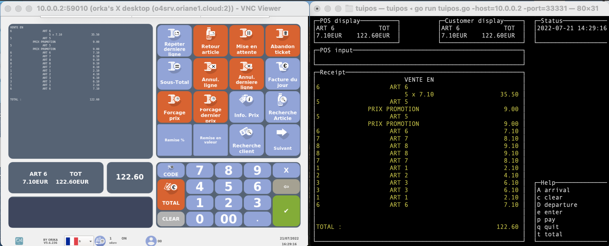

# Development of a cash register frontend in console mode:
tuipos

## Specifications :

Indeed, there are several teams in the maintenance of tills software that deal with bugs reported by customers. I was part of the engine team, which specializes in bugs and issues related to the cash register engine.

The old method of debugging was to start with an analysis of the communication traces between the tills-client and the  engine-server . Therefore we conclude if the problem comes from the engine or not then we replay the bug scenario in a test and we proceed to debug.

Unfortunately in many cases the reported problem does not come from the engine. Sometimes it comes from the display management backend or the tills frontend... which leads to a big waste of time.  This is where the idea came from to develop a tool that we named tuipos and that replaces the graphical cash register in a console that just summarizes the actions that require communication with the engine and thus by replaying the reported bug in the tuipos we will be able to conclude quickly and with certainty if the bug comes from the engine or not and we will go directly into the debugging.

## Demo of tuipos :

<em>Example of a ticket played at the same time by a normal cash register and by a cash register in console mode that we have set up.</em>

